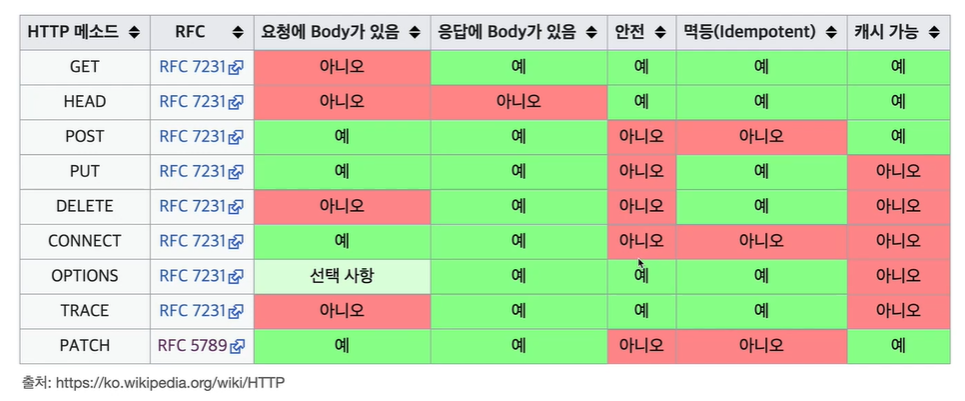

## 멱등(idempotent)?
- 한 번 호출하든 두번 호출하든 100번 호출하든 결과가 똑같다.
- GET : 한번 조회하든, 두 번 조회하든 같은 결과가 조회 됨
- PUT : 결과를 대체함. 따라서 같은 요청을 여러밴 해도 최종 결과는 같다.
- DELETE : 결과를 삭제함. 따라서 같은 요청을 여러번 해도 삭제된 결과는 똑같다.
- `POST` : 멱등하지 않다! ex) 결제 -> 2번 호출하면 2번 결제 됨

## 캐시가능(Cacheable)
- 응답 결과 리소스를 캐시해서 사용해도 되는가?
- GET,HEAD,POST,PATCH => 캐시가 가능하다
- 실제로는 GET,HEAD 정도만 사용!
    - 이유: key가 같아야하는데 POST,PATCH 는 key가 같기 쉽지 않음.

