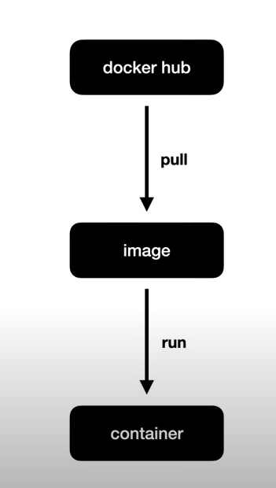
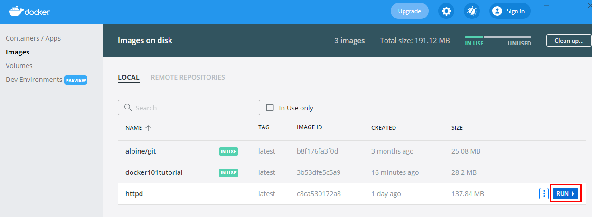
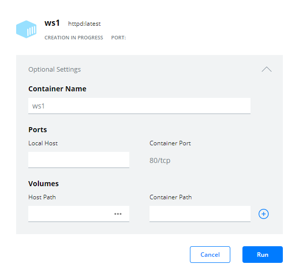
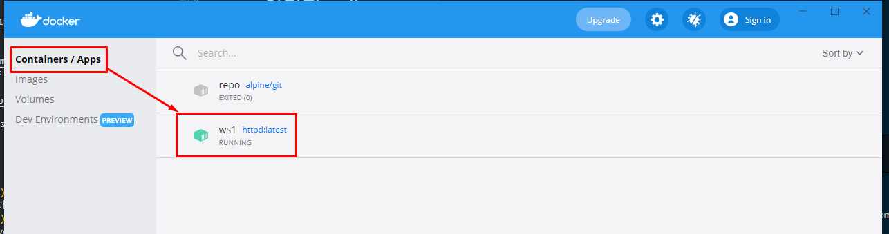

# docker란?
- 도커는 리눅스 컨테이너를 만들고 사용할 수 있도록 하는 컨테이너화 기술이다.
- 하나의 서버에 여러개의 프로그램을 설치하거나 라이브러리 버젼이 다르거나
동일한 포트를 사용하는 경우에 개발환경의 관리는 매우 어려워진다.
- 또한, 웹개발의 경우 웹개발을 위해 또 다른 운영체제를 설치한다는 것 자체가 아까워 보인다.
- DevOps의 등장으로 개발주기가 짧아지면서 배포는 더 자주 이루어지고 
- 마이크로서비스아키텍쳐가 유행하면서 프로그램은 더 잘게 쪼개어져 관리는 더 복잡해졌다.
- 새로운 툴은 계속 나오고 클라우드의 발전으로 설치해야 할 서버가 수도 없이 많아졌다.
- 이러한 상황에서 도커가 등장하고 서버관리 방식이 완전히 바뀌게 되었다.

## 그래서 docker란?
- 도커는 컨테이너 기반의 오픈소스 가상화 플랫폼이다.

# 도커 설치 
- 도커가 알아서 리눅스(가상머신)를 설치해 주고 그 위에 도커를 실행하기 때문에
Window나 Mac을 이용하여서도 설치 할 수 있다.
- 설치 후 WSL 2 installation is incomplete 라는 경고 창이 뜨면서 설치가 안되었다
- https://blog.nachal.com/1691 를 보고 해결
- cmd창에서 docker images를 해서 image들이 보인다면 설치 완료!

# 이미지 pull

1. 이미지를 받아보자
    - https://hub.docker.com/_/httpd apache http server project의 이미지를 받아보자
    - docker pull httpd
    - 참고 : https://docs.docker.com/engine/reference/commandline/pull/
    - 이미지가 잘 받아졌는지 확인하려면 docker images라는 명령어를 사용하면 된다.    

# docker run
1. docker desktop

- run을 누르면 이미지를 컨테이너로 만들 수 있는 대화상자가 뜸

- 이름을 지정해준다. web server라는 의미의 ws1의 이름일 지어준다.
- 그리고 run을 누른다

- 다음과 같이 컨테이너 안에 방금 만든 ws1이 실행되고 있는 것을 확인 할 수 있다.

2. command line
- docker run [OPTIONS] IMAGE [COMMAND] [ARG...]
    - docker run httpd
        - httpd 의 이미지를 사용하여 container를 만듬
    - docker ps 
        - 컨테이너를 보고 싶을땐 ps를 쓴다.
    - docker run --name ws2 httpd
        - 하나의 이미지는 여러개의 컨테이너를 만들 수 있다.
        - name 옵션을 주어 ws2 라는 컨테이너를 만든다
        - docker ps 로 검색하면 ws2 컨테이너를 확인할 수 있다.
    - docker stop ws2
        - 실행중인 컨테이너를 중지 시키고 싶을 땐 stop [id] or stop [name] 을 사용한다
    - docker ps -a 
        - -a : all , stop시킨 컨테이너도 조회 할 수 있다.
    - docker start ws2
        - 중지 시켰던 컨테이너를 다시 켠다
        - 맨 처음 이미지를 이용하여 컨테이너를 만들었을 때 처럼 로그가 나오지 않는다. 이럴땐
        - docker logs ws2 라고 치면 된다.
        - 실시간으로 로그를 확인하고 싶다면
        - docker logs -f ws2 라고 치면 된다.
    - docker rm ws2
        - docker를 삭제한다
        - 실행중인 컨테이너는 삭제할 수 없기 때문에
        - docker stop ws2
        - docker rm ws2
            - 실행중인 걸 한방에 삭제하고싶다면
            - docker rm --force ws2
    - docker rmi
        - image를 삭제할 수 있다
        - docker rmi httpd

# 네트워크
- docker run --name ws3 -p 8082:80 httpd
    - 8082를 80번 포트로 보낸다
- http://localhost:8082/index.html 로 접속
    - "GET/ index.html HTTP/1.1" 200 45 의 메세지가 뜬다.
    - 브라우저에는 it works! 라는 문구가 보인다.

# 명령어 실행
- It works가 아닌 다른 문구가 뜨게 하고 싶다.(index.html을 수정하고 싶다)
- 컨테이너 안에 들어가서 조작해야 한다.

1. docker desktop
- 컨테이너 cli로 들어와서 #pwd를 입력하면 컨테이너 안으로 들어와서 pwd라는 명령어를 실행한거라고 볼 수 있다.

2. cmd
- docker exec [OPTIONS] CONTAINER COMMAND [ARG...]
    - docker exec ws3 pwd
        - 컨테이너를 대상으로 실행 된 명령어
    - docker exec ws3 ls 
        - 마찬가지로 컨테이너의 명령어
    
- 지속적으로 연결하려면
    - docker exec -it ws3 /bin/sh
        - it를 빼고 실행하면 바로 연결이 끊겨서 아무것도 안뜬다.(interactive, tty)
            - iteractive : Keep STDIN open even if not attached
            - tty : Allocate a pseudo-TTY
    - docker exec -it ws3 /bin/sh를 해서 shell 실행
        - pwd , ls al 등의 명령어를 쳐본다.

- /usr/local/apache2/htdocs/ 안에 index.html이 들어있다.
    - docker exec -it ws3 /bin/bash (bash shell 이용)
    - /usr/local/apache2/htdocs/ 
    - ls -al 
    - apt update
    - apt install nano (나노 에디터 설치)
    - nano index.html 을 치면 index.html을 편집 할 수 있는 곳으로 이동하게 됨.
    - 변경하고 ctrl + X , Y , ENTER를 쳐서 저장하고 빠져나옴
    - http://localhost:8082/index.html reload 하면 문구가 변경 된 것을 확인할 수 있음!

# 호스트와 컨테이너의 파일 시스템 연결
- 이전까지의 튜토리얼은 컨테이너 안에서의 파일 변경이였지만
- 이렇게 할 경우 컨테이너가 날라갈 경우 코드 보존이 안된다.
- 따라서 호스트에서 코드를 저장하고 컨테이너에 변경 내용을 반영하는 식의 운영이 필요하다

- 우선 desktop/htdocs/index.html을 만들어 준다.
- docker run -p 8787:80 -v C:\Users\My\Desktop\htdocs:/usr/local/apache2/htdocs/ httpd

- 위와같이 실행하면 호스트에서의 변경파일이 도커 컨테이너에 반영 되는 것을 확인할 수 있다!!