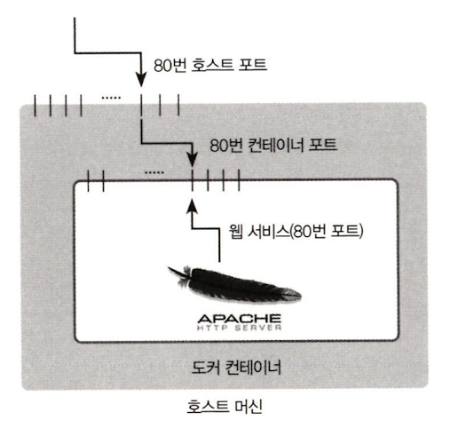

# 이미지
이미지는 컨테이너를 생성할 때 필요한 요소이며, 가상 머신을 생성할 때 사용하는 iso 파일과 비슷한 개념이다.

이미지는 여러 개의 계층으로 된 바이너라 파일로 존재하고, 컨테이너를 생성하고 실행할 때 읽기 전용으로 사용된다.


# 컨테이너
이미지에는 운영체제, 웹서버, 데이터베이스 등 각종 애플리케이션을 설치할 수 있다.

이러한 이미지로 컨테이너를 생성하면 해당 이미지의 목적에 맞는 파일이 들어 있는 파일 시스템과 격리된 시스템 자원 및 네트워크를 사용할 수 있는 독립된 공간이 생성되는데 이를 바로 도커 컨테이너라고 한다.

# 컨테이너 실행하기
`docker -i -t`
- -i 옵션은 상호 입출력
- -t 옵션은 tty 활성화 해서 배쉬 셀을 사용하도록 컨테이너를 설정.

`docker run -i -t image:version`
- 컨테이너 실행과 동시에 컨테이너 내부로 들어가기
- 이미지가 없다면 이미지를 다운받는다.

`docker pull image:version`
- 이미지 다운로드 받기

`docker images`
- 이미지 목록 출력하기

`docker create -i -t --name 이미지이름 image:version`
- image:version 으로 컨테이너 만들기

`docker start container-name`
- start명령어를 통해 컨테이너를 실행합니다. 

`docker attach container-name`
- attach명령어를 통해 컨테이너 내부로 들어갑니다.

## run vs create
- run 명령어는 
docker pull -> docker create -> docker start -> docker attach 순서로 동작

- create 명령어는
docker pull -> docker create 순서로 동작

`exit`
- 컨테이너 종료

`ctrl + P + Q`
- 종료하지 않고 콘솔만 빠져나오기
- `docker attach`를 통해 컨테이너 내부로 다시 들어갈 수 있다.


`docker ps`
- docker process status : 도커 컨테이너 목록 확인
- 정지되지 않은 컨테이너만 출력한다.
- 정지된 컨테이너까지 출력하고 싶으면 `docker ps -a`
- `docker ps -a -q` 를 통해 아이디만 출력

`docker rm 컨테이너_이름`
- 컨테이너 삭제
- 실행중인 컨테이너는 삭제할 수 없다
- `docker stop 컨테이너_이름` 을 먼저 실행해서 컨테이너를 중단시키고 `docker rm` 해야한다

# 컨테이너를 외부에 노출
컨테이너는 가상 머신과 마찬가지로 가상 IP주소를 할당받습니다. 확인하려면
`docker run -i -t --name network_test ubuntu:latest`
이후 컨테이너 내부에서 `ifconfig` 를 통해 확인할 수 있다.
기본적으로 도커는 172.17.0.x 로 시작하는 IP를 순차적으로 할당한다.

```sh
root@86020ba3ee0e:/# ifconfig
eth0      Link encap:Ethernet  HWaddr 02:42:ac:11:00:05  
          inet `addr:172.17.0.5`  Bcast:172.17.255.255  Mask:255.255.0.0
          UP BROADCAST RUNNING MULTICAST  MTU:1500  Metric:1
          RX packets:6 errors:0 dropped:0 overruns:0 frame:0
          TX packets:0 errors:0 dropped:0 overruns:0 carrier:0
          collisions:0 txqueuelen:0 
          RX bytes:516 (516.0 B)  TX bytes:0 (0.0 B)

lo        Link encap:Local Loopback  
          inet addr:127.0.0.1  Mask:255.0.0.0
          UP LOOPBACK RUNNING  MTU:65536  Metric:1
          RX packets:0 errors:0 dropped:0 overruns:0 frame:0
          TX packets:0 errors:0 dropped:0 overruns:0 carrier:0
          collisions:0 txqueuelen:1000 
          RX bytes:0 (0.0 B)  TX bytes:0 (0.0 B)
```

컨테이너의 애플리케이션을 노출하기 위해서 eth0의 IP와 포트를 호스트의 IP와 포트에 바인딩해야한다.

`docker run -i -t --name mywebserver -p 80:80 ubuntu:14.04`
`-p` : 컨테이너의 포트를 호스트의 포트와 바인딩하는 옵션이다
    - [호스트 포트] : [컨테이너 포트]

도커의 포트 포워딩 옵션인 -p 를 써서 호스트와 컨테이너를 연결하는 개념은 매우 중요하다.
순서는 다음과 같다
1. 호스트 IP의 80번 포트로 접근 
2. 80번 포트는 컨테이너의 80번 포트로 포워딩
3. 웹 서버 접근

**호스트의IP 와 포트를 컨테이너의 IP와 포트로 연결한다는 개념은 매우 중요!**
아파치 웹 서버는 172 대역을 가진 컨테이너의 NAT IP와 80번 포트로 서비스하므로 여기에 접근하려면 172.17.0.x:80 의 주소로 접근해야 한다.

그러나 도커의 포트 포워딩 옵션인 -p를 써서 호스트와 컨테이너를 연결했으므로 호스트의 IP와 포트를 통해 172.17.0.x:80으로 접근할 수 있다.

`호스트IP의 80번 포트로 접근 -> 80번 포트는 커네이너의 80번 포트로 포워딩 -> 웹서버 접근`


