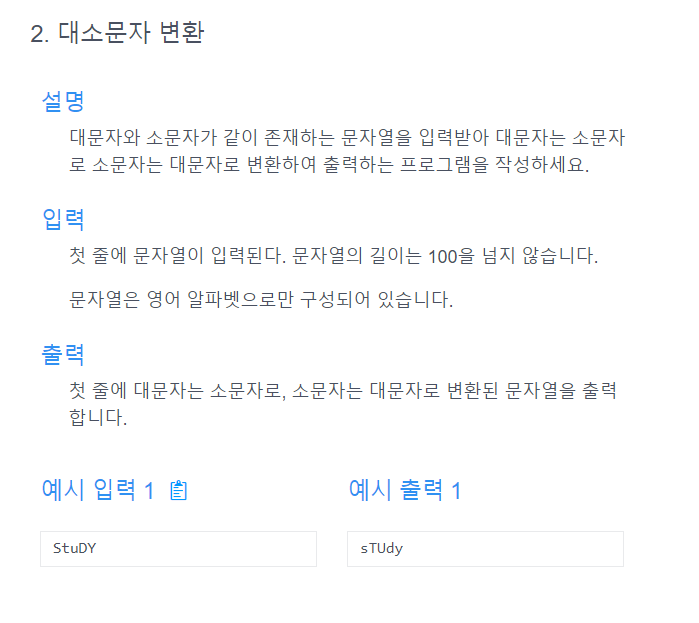

# 문제


# 내 문제 풀이
```java
import java.util.Scanner;

public class Main {
    public static void main(String[] args) {
        Scanner scanner = new Scanner(System.in);
        String a = scanner.next();
        String changeCaseString = changeCase(a);
        System.out.println(changeCaseString);
    }
    
    public static String changeCase(String a){
        StringBuilder stringBuilder = new StringBuilder();
        for(int i=0;i<a.length();i++){
            char c = a.charAt(i);
            if(Character.isLowerCase(c)){
                c = Character.toUpperCase(c);
            }else{
                c = Character.toLowerCase(c);
            }
            stringBuilder.append(c);
        }
        return stringBuilder.toString();
    }
}
```

# 선생님 문제 풀이
```java
import java.util.Scanner;

public class Main {
    public static void main(String[] args) {
        Scanner scanner = new Scanner(System.in);
        String a = scanner.next();
        String changeCaseString = changeCase(a);
        System.out.println(changeCaseString);
    }
    
    public static String changeCase(String str){
        String answer = "";
        for(char x : str.toCharArray()){
            if(Character.isLowerCase(x)){
                answer += Character.toUpperCase(x);
            }else{
                answer += Character.toLowerCase(x);
            }
        }
        return answer;
    }
}

```

# 정리
- 나는 스트링 빌더를 썻고 선생님은 스트링을 썻음
- 향상된 포문이 확실히 더 깔끔한거 같음.
## 또 다른 풀이 : 아스키넘버를 이용할 수 있다.
- A(대문자) : 65~90
- a(소문자) : 97~122
# 선생님 문제 풀이
```java
public static String changeCase(String str){
    String answer = "";
    for(char x : str.toCharArray()){
        if(x>=65 && x<=90){
            answer += (char)(x+32);
        }else if(x>=97 && x<=122){
            answer += (char)(x-32);
        }
    }
    return answer;
}

```
# 질문
- 알파벳이 안들어왔을때의 경우엔 exception?
- 알파벳의 경우를 생각해야하므로 아스키 코드 문제풀이가 더 좋은 것 같다.