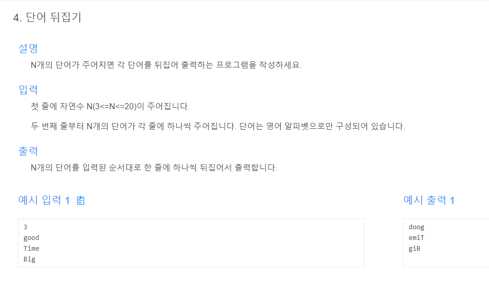

# 내 문제 풀이

```java
import java.util.Scanner;

public class Main {
    public static void main(String[] args) {
        while(true){
            Scanner scanner = new Scanner(System.in);
            String a = scanner.next();
            String answer = answer(a);
            System.out.println(answer);
            i++;
        }
    }
    
    public static String answer(String str){
        boolean isNumber = str.chars().allMatch(Character::isDigit);
        if(isNumber){
            return null;
        }
        char[] strArray = str.toCharArray() ;
        char[] answer = new char[strArray.length];
        for(int i = 0; i<str.length(); i++){
            answer[strArray.length-1-i] = strArray[i];
        }
        return new String(answer);
    }
}
```
## 첫 줄은 무조건 생략하기에 do - while 문을 써서 첫번째 실행 조건에 return null을 할 걸 그랬나?
## n개의 단어가 주어진다는데 입력받는 string을 n개로 구분하는 방법을 모르겠음

---
# 선생님 문제 풀이
## 선생님은 stringBuilder.reverse 를 써서 해결했다.
## N개가 들어온다 N은 3<=N<=20이다. <- 이 조건을 잘 봤어야 했다

```java
import java.util.ArrayList;
import java.util.Scanner;

public class Main {
    public static void main(String[] args) {
        Scanner scanner = new Scanner(System.in);
        int n = scanner.nextInt();
        String[] str = new String[n];
        for (int i = 0; i < n; i++) {
            str[i] = scanner.next();
        }
        for (String x : answer(n, str)) {
            System.out.println(x);
        }
    }

    public static ArrayList<String> answer(int n, String[] str) {
        ArrayList<String> answer = new ArrayList<>();
        for(String x : str){
            String tmp = new StringBuilder(x).reverse().toString();
            answer.add(tmp);
        }
        return answer;
    }
}
```

- 보시다 싶이 나의 풀이와는 완전 다른 걸 알 수 있다.
- n번 반복하는데 n 자체를 문제에 입력 받고 그 걸 배열의 길이로 삼는다.
- 그 후에 그 배열의 인덱스n에 scanner.next()를 넣어서 입력값을 받는 배열을 만들었다.
- 그 이후에 StringBuilder의 reverse함수를 써서 문자가 자동으로 뒤집어지는 것을 알 수 있었다.
- `StringBuilder`를 사용하는 이유를 나중에 한번 꼭 공부해보자.

# 만약 특정 문자만 뒤집는다면?
```java
import java.util.ArrayList;
import java.util.Scanner;

public class Main {
    public static void main(String[] args) {
        Scanner scanner = new Scanner(System.in);
        int n = scanner.nextInt();
        String[] str = new String[n];
        for (int i = 0; i < n; i++) {
            str[i] = scanner.next();
        }
        for (String x : answer(n, str)) {
            System.out.println(x);
        }
    }

    public static ArrayList<String> answer(int n, String[] str) {
        ArrayList<String> answer = new ArrayList<>();
        for(String x : str){
            char[] s = x.toCharArray();
            int lt = 0, rt=x.length()-1;
            while(lt<rt){
                char tmp = s[lt];
                s[lt] = s[rt];
                s[rt] = tmp;
                lt++; rt--;
            }
            String tmp = String.valueOf(s);
            answer.add(tmp);
        }
        return answer;
    }
}
```

- 이런식으로 직접 인덱스롤 잡아서 바꿔줄 수 있다.
- lt = 왼쪽 단어
- rt = 오른쪽 단어
- 다양한 접근 방법을 알아야한다.
- 항상 메서드가 주어지고 내가 그 메서드를 다 통제할 수 있는건 아니기때문이지 않을까?
