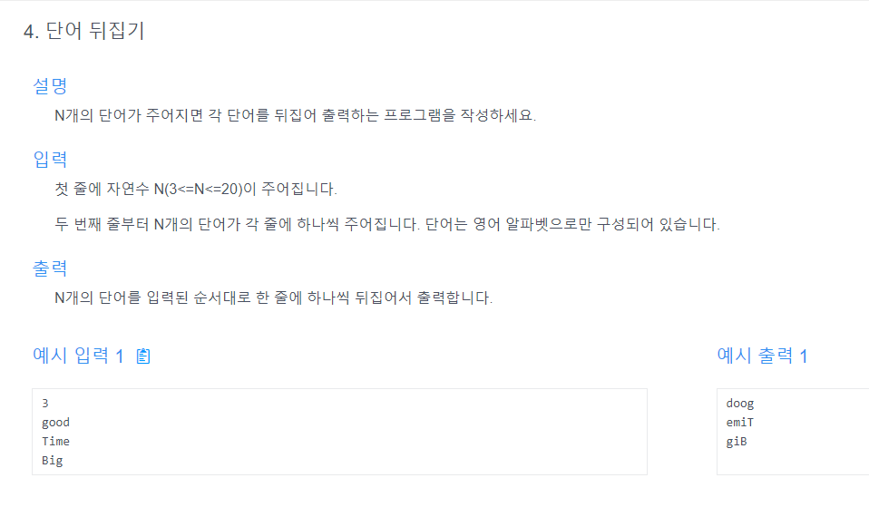

# 내 문제 풀이

```java
import java.util.Scanner;

public class Main {
    public static void main(String[] args) {
        Scanner scanner = new Scanner(System.in);
        String str = scanner.next();
        System.out.println(answer(str));
    }

    public static String answer(String str) {
        char[] answer = str.toCharArray();
        int lt = 0;
        int rt = str.length() - 1;
        while (lt < rt) {
            if (Character.isAlphabetic(answer[lt]) && Character.isAlphabetic(answer[rt])) {
                char tmp = answer[lt];
                answer[lt] = answer[rt];
                answer[rt] = tmp;
            }
            lt++;
            rt--;
        }

        return String.valueOf(answer);

    }
}
```
## 어디서 잘못된건지 잘 모르겠지만...어느 순간부터 오답이 된다. 아마도 인덱스 처리한 곳에서 잘못된 것 같다.

# 두번째 문제 풀이
```java
import java.util.Scanner;

public class Main {
    public static void main(String[] args) {
        Scanner scanner = new Scanner(System.in);
        String str = scanner.next();
        System.out.println(answer(str));
    }

    public static String answer(String str) {
        char[] answer = str.toCharArray();
        int lt = 0;
        int rt = str.length() - 1;
        while (lt < rt) {
            if (!Character.isAlphabetic(answer[lt])){
                lt++;
            }else if (!Character.isAlphabetic(answer[rt])){
                rt--;
            }else{
                char tmp = answer[lt];
                answer[lt] = answer[rt];
                answer[rt] = tmp;
                lt++;
                rt--;
            }
        }

        return String.valueOf(answer);

    }
}
```
## 양 쪽 다 알파벳이여야하고, 아닌 경우에는 각각의 한쪽씩만 인덱스가 증가(감소) 된다는 조건을 몰랐음.


---
# 선생님 문제 풀이

```java
나의 두번째 풀이와 같음.
```
