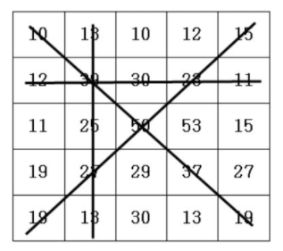

9. 격자판 최대합

5*5 격자판에 아래롸 같이 숫자가 적혀있습니다.



N*N의 격자판이 주어지면 각 행의 합, 각 열의 합, 두 대각선의 합 중 가 장 큰 합을 출력합니다.


입력
첫 줄에 자연수 N이 주어진다.(2<=N<=50)

두 번째 줄부터 N줄에 걸쳐 각 줄에 N개의 자연수가 주어진다. 각 자연수는 100을 넘지 않는다.


출력

# 내 문제 풀이
```java
import java.util.Scanner;

public class Main {
    public static void main(String[] args) {
        Scanner scanner = new Scanner(System.in);
        int n = scanner.nextInt();
        int[][] arr = new int[n][n];
        for (int i = 0; i < n; i++) {
            for (int j = 0; j < n; j++) {
                arr[i][j] = scanner.nextInt();
            }
        }
        System.out.print(solution(arr));
    }

    public static int solution(int[][] arr) {
        int temp1 = 0;
        int temp2 = 0;
        for (int i = 0; i < arr.length; i++) {
            for (int j = 0; j < arr.length; j++) {
                temp2 += arr[i][j];
            }
            if (temp2 > temp1) {
                temp1 = temp2;
            }
            temp2 = 0;
        }

        for (int j = 0; j < arr.length; j++) {
            for (int i = 0; i < arr.length; i++) {
                temp2 += arr[i][j];
            }
            if (temp2 > temp1) {
                temp1 = temp2;
            }
            temp2 = 0;
        }

        for (int j = 0; j < arr.length; j++) {
            for (int i = 0; i < arr.length; i++) {
                if (i == j) {
                    temp2 += arr[i][j];
                }
            }
            if (temp2 > temp1) {
                temp1 = temp2;
            }
            temp2 = 0;
        }
        return temp1;
    }
}
```
- 하드코딩...?
- 가로, 세로, 대각선의 합을 구한다음 각각 비교해서 가장 큰 값을 리턴하게 했다.
- 
---

# 선생님 문제 풀이
```java
import java.util.Scanner;

public class Main {
    public static void main(String[] args) {
        Scanner scanner = new Scanner(System.in);
        int n = scanner.nextInt();
        int[][] arr = new int[n][n];
        for (int i = 0; i < n; i++) {
            for (int j = 0; j < n; j++) {
                arr[i][j] = scanner.nextInt();
            }
        }
        System.out.print(solution(arr));
    }

    public static int solution(int[][] arr) {
        int answer = Integer.MIN_VALUE;
        int sum1, sum2;
        for (int i = 0; i < arr.length; i++) {
            // sum 초기화
            sum1 = 0; sum2 = 0; 
            for (int j = 0; j < arr.length; j++) {
                sum1 += arr[i][j];
                sum2 += arr[j][i];
            }
            if(sum1>answer){
                answer = sum1;
            }
            if(sum2>answer){
                answer = sum2;
            }
        }


        for (int i = 0; i < arr.length; i++) {
            sum1 = 0;
            sum1 += arr[i][i];
            if (sum1 > answer) {
                answer = sum1;
            }
        }

        return answer;

    }

}
```
- 강의에서는 가로 합, 세로 합을 한번의 반복문에서 처리함.
- 만약 메서드를 만들어서 처리한다고 칠 때는 가로,세로를 구분해도 나쁘지 않을 것 같은데
- 지금과 같은 상황에서는 하나의 반복문에서 처리하는게 좋아보인다.
- if문에서 비교하거나 아니면 Math.max(answer,sum1); Math.max(answer,sum2); 를 하는 것도 좋아보인다.
- 대각선 값을 구할때는 2중 for문을 돌릴 필요 없이
- arr[i][i] 와 같이 처리하면 된다.
---
# 정리