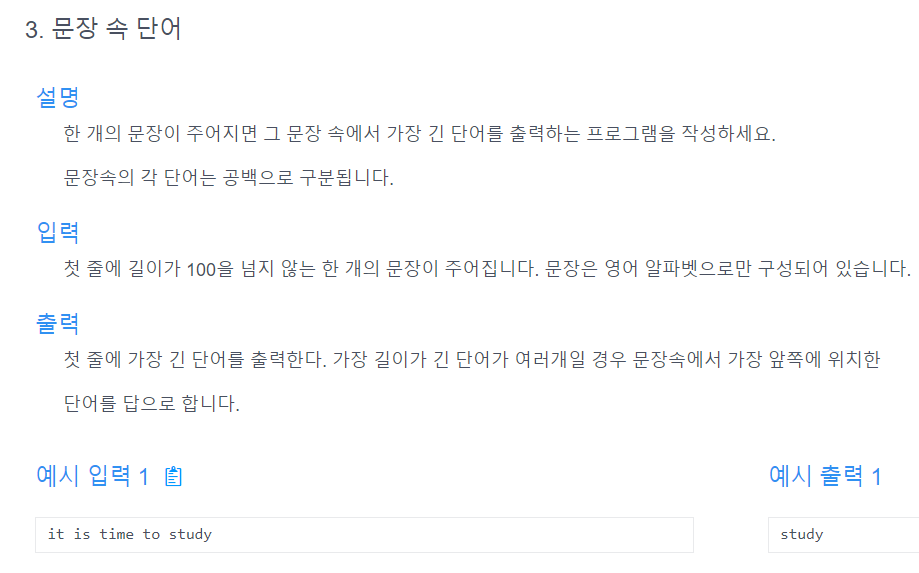

# 문제


# 내 문제 풀이
```java
import java.util.Scanner;

public class Main {
    public static void main(String[] args) {
        Scanner scanner = new Scanner(System.in);
        String str = scanner.nextLine();
        String longestWord = longestWord(str);
        System.out.println(longestWord);
    }

    public static String longestWord(String str) {
        String[] strArray = str.split("\\s+");
        String tmp ;
        for (int i = 0; i < strArray.length-1; i++) {
            if(strArray[i].length()>=strArray[i+1].length()){
                tmp = strArray[i];
                strArray[i] = strArray[i+1];
                strArray[i+1] = tmp;
            }
        }

        return strArray[strArray.length-1];
    }
}

```

# 선생님 문제 풀이
```java
import java.util.Scanner;

public class Main {
    public static void main(String[] args) {
        Scanner scanner = new Scanner(System.in);
        String str = scanner.nextLine();
        System.out.println(solution(str));
    }

    public static String solution(String str) {
        String answer = "";
        int m = Integer.MIN_VALUE;
        String[] s = str.split(" ");
        for(String x : s) {
            int len = x.length();
            if(len>m){
                m=len;
                answer = x;
            }
        }
        return answer;
    }
}

```

## 또 다른 풀이 : indexOf
# 선생님 문제 풀이
```java
import java.util.Scanner;

public class Main {
    public static void main(String[] args) {
        Scanner scanner = new Scanner(System.in);
        String str = scanner.nextLine();
        System.out.println(solution(str));
    }

    public static String solution(String str) {
        String answer = "";
        int m =Integer.MIN_VALUE, pos;
        while((pos=str.indexOf(' '))!= -1){
            String tmp = str.substring(0,pos);
            int len = tmp.length();
            if(len > m){
                m = len;
                answer = tmp;
            }
            str = str.substring(pos+1);
        }
        if(str.length()>m) answer = str;

        return answer;
    }
}

```